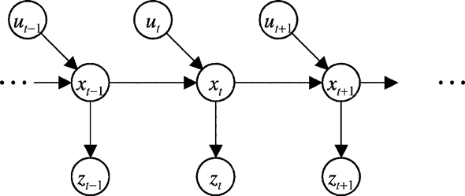

# Bayes Filter

关于本文：这是一份简约的入门教程。

## 滤波是什么

滤波是一种方法，手段，在时移（time-varying）系统中，通过对带有噪声的观测${z_k}$ 来估计隐状态$x_k$的处理方法；

滤波（filtering）专门是指利用前面 $k$个观测 $z_1,z_2,...,z_k$  来估计第$k$个隐状态$x_k$的方法,记作$x_k|z_{1:k}$。

另外，如果利用前面$d(d<k)$个观测来估计第$k$个状态，则称为预测（prediction），具体地，叫 $k-d$步预测；

如果利用前面$d$个观测 $z_{1:d}$来估计第$k$个状态，则称为平滑或内插（smoothing)。

所以其实滤波(filtering)就是 $d=k$ 的情形。

## 状态、控制、观测

但是上述定义并没有考虑系统的控制量，如果考虑控制量，系统模型就如图1所示:

符号说明：$x$为状态量，$z$为观测量，$u$为控制量

注意，这张图非常重要，它代表着隐马尔可夫模型（HMM），后者是贝叶斯滤波的基础假设，对隐马尔可夫模型的探讨超出了本篇的范畴，这里只做简单介绍。读者可以想象，作为一个普通人（不是全知全能的神明），想要知道一个系统的状态，只能通过测量的手段，再通过滤波等手段得到状态的最优估计。在这里，系统状态$x$就是隐变量，观测值$z$是观测变量。观测得到的是既定的结果，但在它的背后，真实的状态其实是在以一定概率转移的，并且状态本身未必是确定的，它可能是一个范围，有一定的方差（模型噪声）。另一方面，测量所用的仪器存在量测误差（噪声），这个量测误差是随机的，又在观测值背后增加了一层随机性。而我们的目的就是从既定的结果去估计一个随机变量（是不是感觉跟极大似然估计很像？）。

## 贝叶斯滤波

贝叶斯滤波的目标是得到$P(x_k|z_{1:k},u_{1:k})$，它的含义是在前k个观测值和控制量的基础上估计第k个状态（状态估计），我们的目标是得到$P(x_k|z_{1:k},u_{1:k})$的递推形式。先来看第一个重要的公式：

$$
P(x_k|z_{1:k},u_{1:k})=\frac{P(z_k|x_k,z_{1:k-1},u_{1:k})P(x_k|z_{1:k-1},u_{1:k})}{P(z_k|z_{1:k-1},u_{1:k})} \tag{1.1}
$$
这个公式就是在$z_{1:k-1},u_{1:k}$条件下的贝叶斯公式（这大概就是贝叶斯滤波为什么叫贝叶斯滤波的原因吧）

接下来讲引入贝叶斯滤波中的基本假设：**Markov性假设: k时刻的状态由k-1时刻的状态和k时刻输入的控制量决定。k时刻的观测仅同k时刻的状态相关。**由此我们得到
$$
P(x_k|x_{1:k-1},z_{1:k},u_{1:k})=P(x_k|x_{k-1},u_k) \\
P(z_k|x_k,z_{1:k-1},u_{1:k})=P(z_k|x_k)  \\
P(z_k|z_{1:k-1},u_{1:k})=P(z_k) \tag{1.2}
$$

**上述假设可以通过图1得到直观的理解。**$P(z_k)$与我们所关心的状态$x_k$无关，所以可以把它当做归一化常数$\eta_k$

为了得到递推形式，我们很自然能想到引出上一时刻的状态$x_{k-1}$，只需要简单地运用全概率公式即可：
$$
P(x_k|z_{1:k-1},u_{1:k})=\int P(x_k|x_{k-1},z_{1:k-1},u_{1:k})P(x_{k-1}|z_{1:k-1},u_{1:k})dx_{k-1}\tag{1.3}
$$
因为$x_{k-1}$与$u_k$无关，所以式(1.3)修正一下$u$的下标变为
$$
P(x_k|z_{1:k-1},u_{1:k})=\int P(x_k|x_{k-1},z_{1:k-1},u_{1:k})P(x_{k-1}|z_{1:k-1},u_{1:k-1})dx_{k-1}\tag{1.3.1}
$$

继而式(1.1)可以化成
$$
P(x_k|z_{1:k},u_{1:k})=\eta_kP(z_k|x_k)\int P(x_k|x_{k-1},z_{1:k-1},u_{1:k})P(x_{k-1}|z_{1:k-1},u_{1:k-1})dx_{k-1} \tag{1.4}
$$
至此，我们得到了贝叶斯滤波的递归形式，之后可能会增加代码实现部分，和对系统模型的进一步说明。

## 参考资料

1.[细说贝叶斯滤波：Bayes filters](https://www.cnblogs.com/ycwang16/p/5995702.html)

2.[通俗地解释卡尔曼滤波器（一）——从贝叶斯滤波器说起](https://zhuanlan.zhihu.com/p/318701822)

3.[贝叶斯滤波（Bayesian filtering)](https://zhuanlan.zhihu.com/p/139215491)