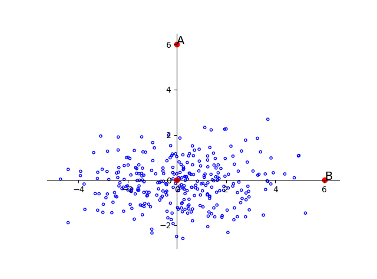
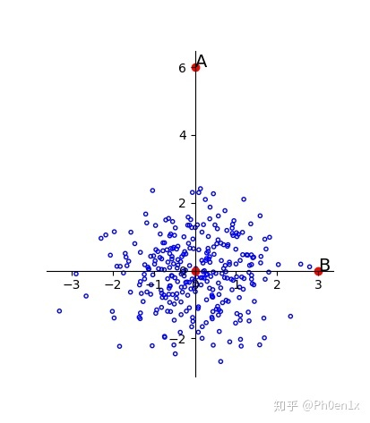
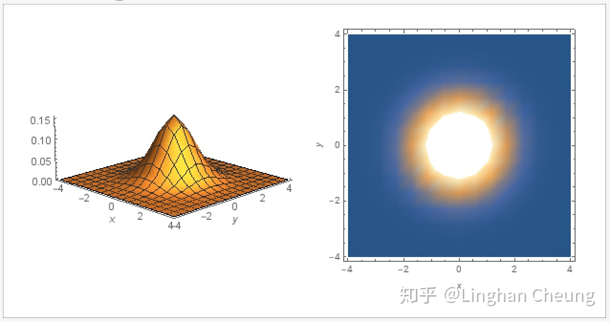
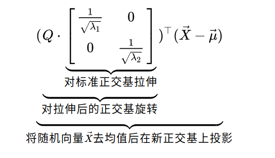
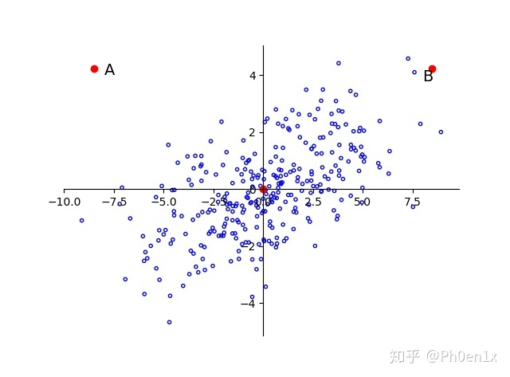
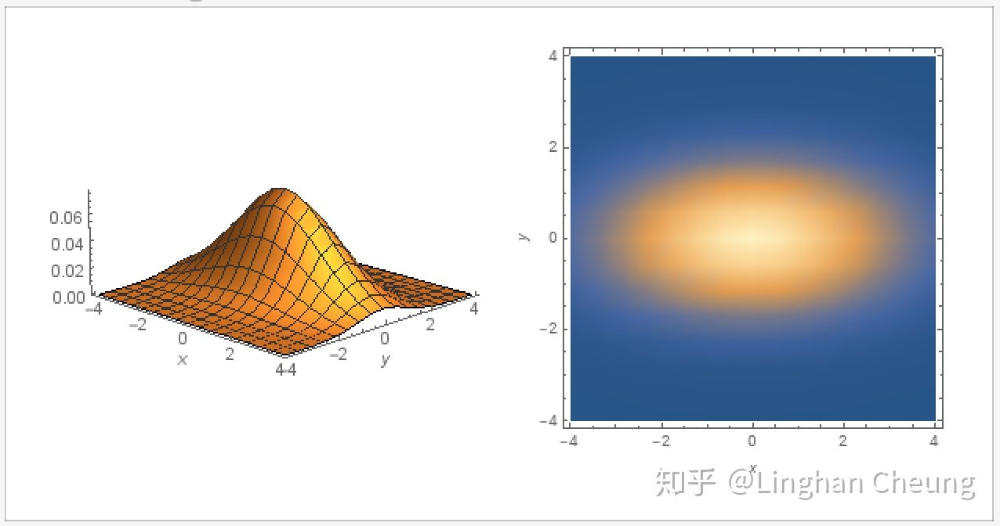
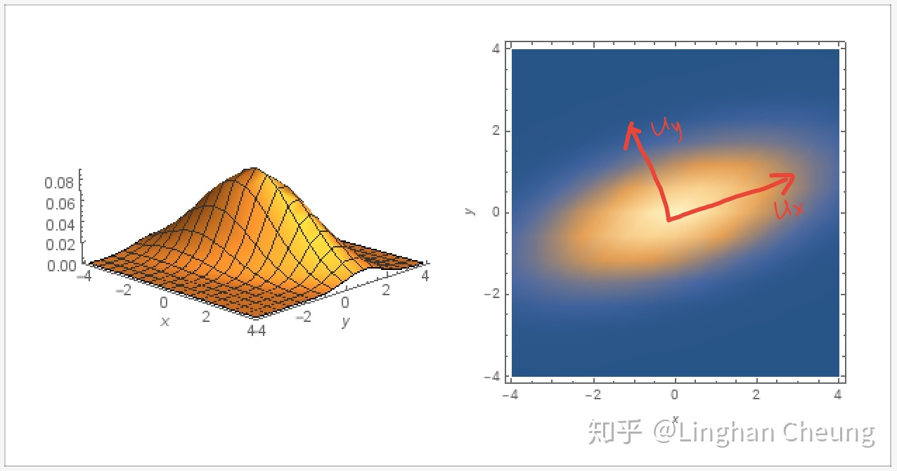

# 多元高斯分布完全指南

## 引子

先来看一张图：

如果我让你从A、B中选出一个离群点，你觉得谁更合适？从欧式距离来比较，A、B两点到均值（图中的原点）的距离相同，但从直觉上看，B显然更融入群体。这是因为两者在比较时尺度或者说量纲（scalar）没有统一，就像你拿百万面额的津巴布韦币同人民币做比较一样，图中对应的尺度就是维度的方差。当你对每个维度的尺度进行归一化处理后（即让维度上的每个数据除以维度对应的标准差（方差的算数平方根）为什么是平方根？因为我们最终希望修正后的尺度可以简单采用欧式距离，而欧式距离的定义中显然有一个平方根）图就变成下面这样：

现在就可以简单地用欧式距离判断谁是离群点了

## 一元高斯分布

如果你学过概率论，那你应该对上面的引子感到熟悉，因为在一元高斯分布中，我们经常会对随机变量$X$进行标准化——$Z=\frac{X-\mu}{\sigma}$，这同之前我们所做的工作相比不能说完全一致，只能说一模一样（XD）。引子就先告一段落，我们很快会再来回顾它。先来复习一下一元高斯分布的有关知识：
$$
\begin{aligned}
p(x) &=\frac{1}{\sigma \sqrt{2 \pi}} \cdot e^{-\frac{1}{2} \cdot\left(\frac{x-\mu}{\sigma}\right)^{2}} \\
1 &=\int_{-\infty}^{+\infty} p(x)dx
\end{aligned}
\tag{1}
$$
令$Z=\frac{X-\mu}{\sigma}$
$$
\begin{aligned}
\because x(z) &=z \cdot \sigma+\mu \\
\therefore p(x(z)) &=\frac{1}{\sigma \sqrt{2 \pi}} \cdot e^{-\frac{1}{2} \cdot(z)^{2}} \\
1 &=\int_{-\infty}^{+\infty} p(x(z)) d x \\
&=\int_{-\infty}^{+\infty} \frac{1}{\sigma \sqrt{2 \pi}} \cdot e^{-\frac{1}{2} \cdot(z)^{2}} d x \\
&=\int_{-\infty}^{+\infty} \frac{1}{\sqrt{2 \pi}} \cdot e^{-\frac{1}{2} \cdot(z)^{2}} dz 
\end{aligned}
\tag{2}
$$
此时我们说随机变量 $Z \sim \mathcal{N}(0,1)$ 服从一元标准高斯分布, 其均值 $\mu=0,$ 方差 $\sigma^{2}=1,$ 其概率密度函数为
$$
p(z)=\frac{1}{\sqrt{2 \pi}} \cdot e^{-\frac{1}{2} \cdot(z)^{2}}
\tag{3}
$$

## 多元高斯分布

### 1.概率密度函数（PDF）

接下来我们将正式探讨多元情况下的高斯分布，从一元到多元，我们的随机变量也进化成了随机向量，我们用$X=(x_1,x_2,...,x_n)$表示，$x_i$是向量的一个分量，是单个随机变量。我们先从最简单的情况，各个随机变量之间相互独立，开始讨论。

假设我们有随机向量 $\vec{Z}=\left[Z_{1}, \cdots, Z_{n}\right]^{\top},$ 其中 $Z_{i} \sim \mathcal{N}(0,1)(i=1, \cdots, n)$ 且 $Z_{i}, Z_{j}(i, j=1, \cdots, n \wedge i \neq j)$ 彼此独立, 即随机向量中的每个随机变量 $Z_{i}$ 都服从标准高斯分布且两两彼此独立. 则由(3)与独立随机变量概率密度函数之间的关系, 我们可得随机向量 $\vec{Z}=\left[Z_{1}, \cdots, Z_{n}\right]^{\top}$ 的联合概率密度函数为
$$
\begin{aligned}
p\left(z_{1}, \cdots, z_{n}\right) &=\prod_{i=1}^{n} \frac{1}{\sqrt{2 \pi}} \cdot e^{-\frac{1}{2} \cdot\left(z_{i}\right)^{2}} \\
&=\frac{1}{(2 \pi)^{\frac{n}{2}}} \cdot e^{-\frac{1}{2} \cdot\left(Z^{\top} Z\right)} \\
1 &=\int_{-\infty}^{+\infty} \cdots \int_{-\infty}^{+\infty} p\left(z_{1}, \cdots, z_{n}\right) d z_{1} \cdots d z_{n}
\end{aligned}
\tag{4}
$$
我们称随机向量 $\vec{Z} \sim \mathcal{N}(\overrightarrow{0}, \mathbf{I})$, 即随机向量服从均值为零向量, 协方差矩阵为单位矩阵的高斯分布. 在这里, 随机向量 $\vec{Z}$ 的协方差矩阵是 $\operatorname{Cov}\left(Z_{i}, Z_{j}\right), i, j=1, \cdots, n$ 组成的矩阵, 即
$$
\begin{aligned}
\left[\operatorname{Cov}\left(Z_{i}, Z_{j}\right)\right]_{n \times n} &=\mathbf{E}\left[(Z-\vec{\mu})(Z-\vec{\mu})^{\top}\right] \\
&=\mathbf{I}
\end{aligned}
\tag{5}
$$
由于随机向量 $\vec{Z} \sim \mathcal{N}(\overrightarrow{0}, \mathbf{I}),$ 所以其协方差矩阵的对角线元素为1, 其余元素为0. 如果我们取常数 $c=p\left(z_{1}, \cdots, z_{n}\right),$ 则可得函数 $p\left(z_{1}, \cdots, z_{n}\right)$ 的等高线为 $c^{\prime}=Z^{\top} Z,$ 当随机向量 $\vec{Z}$ 为二维向量
时, 我们有
$$
c^{\prime}=Z^{\top} \cdot Z=\left(z_{1}-0\right)^{2}+\left(z_{2}-0\right)^{2}
\tag{6}
$$
显然，其等高线是以(0，0)为圆心的同心圆。

接下来讨论各随机变量不相互独立的一般情况：

既然我们能够轻松地处理独立的情况，那只要我们能够把一般的情况转化成独立的情况，问题是不是就迎刃而解了呢？答案是肯定的，幸运的是，我们有如下定理：

**定理1: 若存在随机向量 $\vec{X} \sim \mathcal{N}(\vec{\mu}, \Sigma),$ 其中 $\vec{\mu} \in R^{n}$ 为均值向量, $\Sigma \in S_{++}^{n \times n}$ 半正定实对称矩阵为 $\vec{X}$ 的协方差矩阵, 则存在满秩矩阵 $B \in R^{n \times n},$ 使得 $\vec{Z}=B^{-1}(\vec{X}-\vec{\mu}),$ 而 $\vec{Z} \sim \mathcal{N}(\overrightarrow{0},\mathbf{I})$.**

（满秩的原因是我们需要求逆）

有了定理1, 我们就可以对随机向量$\vec{X}$ 做相应的线性变换, 使其随机变量在线性变换后彼此独立, 从而求出其联合概率密度函数, 具体地

$$
\begin{aligned}
\because \vec{Z}&=B^{-1}(\vec{X}-\vec{\mu}), \vec{Z} \sim \mathcal{N}(\overrightarrow{0}, I)\\
\therefore \quad p\left(z_{1}, \cdots, z_{n}\right) &=\frac{1}{(2 \pi)^{\frac{n}{2}}} \cdot e^{-\frac{1}{2} \cdot\left(Z^{\top} Z\right)} \\
p\left(z_{1}\left(x_{1}, \cdots, x_{n}\right), \cdots\right) &=\frac{1}{(2 \pi)^{\frac{n}{2}}} \cdot e^{-\frac{1}{2} \cdot\left[\left(B^{-1}(\vec{X}-\vec{\mu})\right)^{\top}\left(B^{-1}(\vec{X}-\vec{\mu})\right)\right]} \\
&=\frac{1}{(2 \pi)^{\frac{n}{2}}} \cdot e^{-\frac{1}{2} \cdot\left[(\vec{X}-\vec{\mu})^{\top}\left(B B^{\top}\right)^{-1}(\vec{X}-\vec{\mu})\right]} 
\end{aligned}
\tag{7}
$$
$$
\begin{aligned}
\therefore \quad 1 &=\int_{-\infty}^{+\infty} \cdots \int_{-\infty}^{+\infty} p\left(z_{1}\left(x_{1}, \cdots, x_{n}\right), \cdots\right) d z_{1} \cdots d z_{n} \\
&=\int_{-\infty}^{+\infty} \cdots \int_{-\infty}^{+\infty} \frac{1}{(2 \pi)^{\frac{n}{2}}} \cdot e^{-\frac{1}{2} \cdot\left[(\vec{X}-\vec{\mu})^{\top}\left(B B^{\top}\right)^{-1}(\vec{X}-\vec{\mu})\right]} d z_{1} \cdots d z_{n}
\end{aligned}
\tag{8}
$$

由多元函数换元变换公式, 我们还需要求出雅可比行列式 $J(\vec{Z} \rightarrow \vec{X}),$ 由(7)可得
$$
J(\vec{Z} \rightarrow \vec{X})=\left|B^{-1}\right|=|B|^{-1}=|B|^{-\frac{1}{2}} \cdot\left|B^{\top}\right|^{-\frac{1}{2}}=\left|B B^{\top}\right|^{-\frac{1}{2}}
\tag{9}
$$
由(8)(9), 我们可进一步得
$$
1=\int_{-\infty}^{+\infty} \cdots \int_{-\infty}^{+\infty} \frac{1}{(2 \pi)^{\frac{n}{2}}\left|B B^{\top}\right|^{\frac{1}{2}}} \cdot e^{-\frac{1}{2} \cdot\left[(\vec{X}-\vec{\mu})^{\top}\left(B B^{\top}\right)^{-1}(\vec{X}-\vec{\mu})\right]} d x_{1} \cdots d x_{n}
\tag{10}
$$
我们得到随机向量$\vec{X} \sim \mathcal{N}(\vec{\mu}, \Sigma)$ 的联合概率密度函数为
$$
p\left(x_{1}, \cdots, x_{n}\right)=\frac{1}{(2 \pi)^{\frac{n}{2}}\left|B B^{\top}\right|^{\frac{1}{2}}} \cdot e^{-\frac{1}{2} \cdot\left[(\vec{X}-\vec{\mu})^{\top}\left(B B^{\top}\right)^{-1}(\vec{X}-\vec{\mu})\right]}
\tag{11}
$$
在(11)中, 随机向量$\vec{X}$ 的协方差矩阵还未得到体现, 我们可通过线性变换(7)做进一步处理
$$
\begin{aligned}
\Sigma &=\mathbf{E}[(\vec{X}-\vec{\mu})(\vec{X}-\vec{\mu})^{\top}] \\
&=\mathbf{E}[(B \vec{Z}-\overrightarrow{0})(B \vec{Z}-\overrightarrow{0})^{\top}] \\
&=\operatorname{Var}(B \vec{Z}) \\
&=B \operatorname{Var}(\vec{Z}) B^{\top} \\
&=B B^{\top}
\end{aligned}
\tag{12}
$$
>  常用结论：$E(A\vec{Z}+B)=AE(\vec{Z})+B\\Var(A\vec{Z}+B)=AVar(\vec{Z})A^{\top}$

我们发现, (11)中 $B B^{\top}$ 就是线性变换前的随机向量 $\vec{X} \sim \mathcal{N}(\vec{\mu}, \Sigma)$ 的协方差矩阵 $\Sigma$, 所以由(11)(12), 我们可以得到联合概率密度函数的最终形式
$$
p\left(x_{1}, \cdots, x_{n}\right)=\frac{1}{(2 \pi)^{\frac{n}{2}}|\Sigma|^{\frac{1}{2}}} \cdot e^{.-\frac{1}{2} \cdot [(\vec{X}-\vec{\mu})^{\top} \Sigma^{-1}(\vec{X}-\vec{\mu})]}
\tag{13}
$$
这就是多元高斯分布的概率密度函数($pdf$)，非常重要，建议刻进DNA里。

### 2.马氏距离与几何意义

接下来，我们将引入一个广泛被使用的距离度量——马氏距离(Mahalanobis Distance)。单个数据点的马氏距离：$D_{M}(x)=\sqrt{(x-\mu)^{T} \Sigma^{-1}(x-\mu)}$

是不是很眼熟，没错，其形式与我们刚刚讨论完的多元高斯分布概率密度函数的指数部分完全一致！接下来让我们来看看这个形式究竟有什么几何意义:

由定理1我们有
$$
\begin{aligned}
\because \quad \vec{Z} &=B^{-1}(\vec{X}-\vec{\mu}), \vec{Z} \sim \mathcal{N}(\overrightarrow{0}, I) \\
\therefore \quad \vec{Z}^{\top} \vec{Z} &=\left(B^{-1}(\vec{X}-\vec{\mu})\right)^{\top}\left(B^{-1}(\vec{X}-\vec{\mu})\right) \\
&=(\vec{X}-\vec{\mu})^{\top}\left(B B^{\top}\right)^{-1}(\vec{X}-\vec{\mu}) \\
&=(\vec{X}-\vec{\mu})^{\top} \Sigma^{-1}(\vec{X}-\vec{\mu})
\end{aligned}
\tag{14}
$$
再由(12)(14)可得
$$
\begin{aligned}
\vec{Z}^{\top} \vec{Z} &=\left[Q^{\top}(\vec{X}-\vec{\mu})\right]^{\top} \Lambda^{-1}\left[Q^{\top}(\vec{X}-\vec{\mu})\right] \\
&=\left[Q^{\top}(\vec{X}-\vec{\mu})\right]^{\top}\left(\Lambda^{-\frac{1}{2}}\right)^{\top} \Lambda^{-\frac{1}{2}}\left[Q^{\top}(\vec{X}-\vec{\mu})\right] \\
&=\left[\Lambda^{-\frac{1}{2}} Q^{\top}(\vec{X}-\vec{\mu})\right]^{\top}\left[\Lambda^{-\frac{1}{2}} Q^{\top}(\vec{X}-\vec{\mu})\right] \\
&=\left[\left(Q \Lambda^{-\frac{1}{2}}\right)^{\top}(\vec{X}-\vec{\mu})\right]^{\top}\left[\left(Q \Lambda^{-\frac{1}{2}}\right)^{\top}(\vec{X}-\vec{\mu})\right] \\
&=\left[\left(Q \cdot\left[\begin{array}{cc}
\frac{1}{\sqrt{\lambda_{1}}} & 0 \\
0 & \frac{1}{\sqrt{\lambda_{2}}}
\end{array}\right]\right)^{\top}(\vec{X}-\vec{\mu})\right]^{\top} \\
& \cdot\left[\left(Q \cdot\left[\begin{array}{cc}
\frac{1}{\sqrt{\lambda_{1}}} & 0 \\
0 & \frac{1}{\sqrt{\lambda_{2}}}
\end{array}\right]\right)^{\top}(\vec{X}-\vec{\mu})\right]
\end{aligned}
\tag{15}
$$
由(15)我们已经可以非常明显地看出线性变换 $\vec{Z}=B^{-1}(\vec{X}-\vec{\mu})$ 的具体操作了

上述公式看起来繁琐，实际上只是简单地对协方差矩阵$\Sigma$做了特征分解（协方差矩阵对称半正定）$\lambda$就是特征值。

回顾一下本篇一开始的引子，由特征值组成的对角阵的作用就是对维度进行拉伸或者说放缩，就是让维度上的数据除以对应的标准差，显然，作为对角阵的协方差矩阵的特征值就是对应维度的方差，两者在此得到统一。接下来看矩阵$Q$的作用，我们继续顺着引子的思路探索下去，统一了维度间的尺度或量纲就高枕无忧了吗，来看一种情况：

A与B的欧式距离相同，各维度的尺度也得到了统一，但直觉告诉我们，B点显然更合群，为什么？因为维度之间并不是独立的，图中两个维度线性相关，为了修正这种情况，我们需要去相关化，而这就是

矩阵$Q$所做的工作。如果维度间保持独立，即协方差矩阵是对角阵，那么$Q$就是单位矩阵$I$。这个时候，等高线的图案是一个标准的椭圆（为什么是椭圆而不是圆，因为特征值对维度进行了拉伸，形成了椭圆的实轴与虚轴）等高线的公式如下,二维情况下就是椭圆：
$$
\Delta=(x-\mu)^{T}\Sigma^{-1}(x-\mu)=\sum\limits _{i=1}^{p}(x-\mu)^{T}u_{i}\frac{1}{\lambda_{i}}u_{i}^{T}(x-\mu)=\sum\limits _{i=1}^{p}\frac{y_{i}^{2}}{\lambda_{i}}
\tag{16}
$$

一般情况下，$Q$则是由特征向量堆叠而成的正交矩阵（如果感到陌生的化可以复习一下线代），而等高线变成一个倾斜的椭圆：

你可以把$Q$理解成旋转矩阵，对标准的椭圆进行旋转（因为旋转矩阵非常普遍与实用，有机会的话我会单独拿出来讲一讲）。也可以认为椭圆其实没变，只是基变了，或者说参考的坐标轴变了，不再是标准正交基，而变成了$Q$中的特征向量组成的单位正交基，在新的坐标轴下（图中的$u_{x}$,$u_{y}$），椭圆依然是标准的，维度依然是相互独立的。

总结一下：马氏距离就是对原维度进行**尺度归一化加去相关性**，在新的维度下，数据之间的度量就可以简单地用欧氏距离表示。而我们在推导高斯分布的概率密度函数时所用的矩阵$B^{-1}$代表的线性变换也是**拉伸与去相关性**（如果你对此还有疑惑，可以回顾一下图4），使得一般的情况转化为简单的独立情况，方便我们处理。这种转换的思想非常重要，在很多方面都有精彩的运用，比如把非线性问题转换成线性问题来处理。

### 3.条件概率与边缘概率

接下来我们将要探索多元高斯的条件概率分布与边缘概率分布，这一块在统计推断与机器学习中有重要应用，但因为推导的过程比较复杂，不要求完全掌握推导过程，只要混个眼熟就行。我们记 $x=(x_1, x_2,\cdots,x_p)^T=(x_{a,m\times 1}, x_{b,n\times1})^T,\mu=(\mu_{a,m\times1}, \mu_{b,n\times1}),\Sigma=\begin{pmatrix}\Sigma_{aa}&\Sigma_{ab}\\\Sigma_{ba}&\Sigma_{bb}\end{pmatrix}$，已知 $x\sim\mathcal{N}(\mu,\Sigma)$。

我们的目标是得到 $p(x_a),p(x_b),p(x_a|x_b),p(x_b|x_a)$ 这四个量。

先来推边缘概率，首先放一个引理：

**定理2：已知 $x\sim\mathcal{N}(\mu,\Sigma), y\sim Ax+b$，那么 $y\sim\mathcal{N}(A\mu+b, A\Sigma A^T)$。$\mathbb{E}[y]=\mathbb{E}[Ax+b]=A\mathbb{E}[x]+b=A\mu+b$，$Var[y]=Var[Ax+b]=Var[Ax]=A\cdot Var[x]\cdot A^T$。**

（这个定理应该很符合直觉，也非常容易记忆）

我们可以把随机向量$X$分成两部分$\begin{pmatrix}x_a\\x_b\end{pmatrix}$，$x_a$为m维列向量，$x_b$为n维列向量。现在我们想要求出$x_a$服从的概率分布（利用对称性可以推出$x_b$）直觉上猜测可能服从某一高斯分布，事实上也确实如此（高斯分布的优良性质）。我们可以构造出如下等式：
$$
x_a=\underbrace{\begin{pmatrix}\mathbb{I}_{m\times m}&\mathbb{O}_{m\times n}\end{pmatrix}}_{相当于A}\underbrace{\begin{pmatrix}x_a\\x_b\end{pmatrix}}_{X}
\tag{17}
$$

利用引理可以得到：
$$
\begin{align}
&\mathbb{E}[x_a]=\begin{pmatrix}\mathbb{I}&\mathbb{O}\end{pmatrix}\begin{pmatrix}\mu_a\\\mu_b\end{pmatrix}=\mu_a\\
&Var[x_a]=\begin{pmatrix}\mathbb{I}&\mathbb{O}\end{pmatrix}\begin{pmatrix}\Sigma_{aa}&\Sigma_{ab}\\\Sigma_{ba}&\Sigma_{bb}\end{pmatrix}\begin{pmatrix}\mathbb{I}\\\mathbb{O}\end{pmatrix}=\Sigma_{aa}\\
& x_a\sim\mathcal{N}(\mu_a,\Sigma_{aa})
\end{align}
\tag{18}
$$
同理可得$x_b$的情况，这里就不赘述了。

接下来推条件概率（相关的推导方式不唯一，这里我们选择一种比较有技巧性的构造推导）

我们定义3个符号量
$$
x_{b\cdot a}=x_b-\Sigma_{ba}\Sigma_{aa}^{-1}x_a\\
\mu_{b\cdot a}=\mu_b-\Sigma_{ba}\Sigma_{aa}^{-1}\mu_a\\
\Sigma_{bb\cdot a}=\Sigma_{bb}-\Sigma_{ba}\Sigma_{aa}^{-1}\Sigma_{ab}
\tag{19}
$$
需要注意的是，**3个符号量中只有第一个才是我们定义的（后续将在它的基础上进行推导），后两个都是在第一个基础上推出来的，只是先在这里列出来**。$x_{b\cdot a}$的具体定义自于技巧性的构造，但我们简单地观察一下形式可以发现，一旦我们得到了$x_{b\cdot a}$服从的分布的信息，我们就能建立$x_a$与$x_b$之间的联系，继而推出$p(x_b|x_a)$。根据$x_{b\cdot a}$的定义，我们构造如下等式：
$$
x_{b\cdot a}=\begin{pmatrix}-\Sigma_{ba}\Sigma_{aa}^{-1}&\mathbb{I}_{n\times n}\end{pmatrix}\begin{pmatrix}x_a\\x_b\end{pmatrix}
\tag{20}
$$
利用引理可得：
$$
\mathbb{E}[x_{b\cdot a}]=\begin{pmatrix}-\Sigma_{ba}\Sigma_{aa}^{-1}&\mathbb{I}_{n\times n}\end{pmatrix}\begin{pmatrix}\mu_a\\\mu_b\end{pmatrix}=\mu_{b\cdot a}\\
Var[x_{b\cdot a}]=\begin{pmatrix}-\Sigma_{ba}\Sigma_{aa}^{-1}&\mathbb{I}_{n\times n}\end{pmatrix}\begin{pmatrix}\Sigma_{aa}&\Sigma_{ab}\\\Sigma_{ba}&\Sigma_{bb}\end{pmatrix}\begin{pmatrix}-\Sigma_{aa}^{-1}\Sigma_{ba}^T\\\mathbb{I}_{n\times n}\end{pmatrix}=\Sigma_{bb\cdot a}
\tag{21}
$$
我们对$x_{b\cdot a}$的定义式（式（19））做个小变形得到
$$
x_b=x_{b\cdot a}+\Sigma_{ba}\Sigma_{aa}^{-1}x_a \tag{21}
$$
再次利用引理可得
$$
\begin{align}
&\mathbb{E}[x_b|x_a]=\mu_{b\cdot a}+\Sigma_{ba}\Sigma_{aa}^{-1}x_a\\
&Var[x_b|x_a]=\Sigma_{bb\cdot a}\\
&x_b|x_a\sim\mathcal{N}(\mu_{b\cdot a}+\Sigma_{ba}\Sigma_{aa}^{-1}x_a,\Sigma_{bb\cdot a})
\end{align}
\tag{22}
$$
$x_b$同理可得（简单交换ab次序就行）

这里再多提一点
$$
Var[x_b|x_a]=\Sigma_{bb\cdot a}=\Sigma_{bb}-\Sigma_{ba}\Sigma_{aa}^{-1}\Sigma_{ab}
$$
其形式就是线性代数中的舒尔补（Schur complement），感兴趣的读者可以自行Google。

## 参考资料

1.[多元高斯分布完全解析](https://zhuanlan.zhihu.com/p/58987388)

2.[马氏距离(Mahalanobis Distance)](https://zhuanlan.zhihu.com/p/46626607)

3.机器学习-白板推导系列